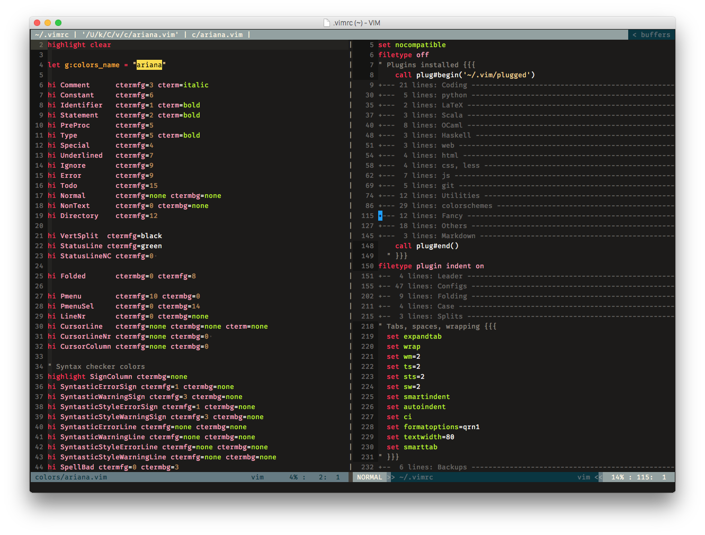

# Description
This is the vim configuration that I ripped off from [KHZ](https://github.com/khzaw).

The original of his is [here](https://github.com/khzaw/dotvim)

All the following instructions are drafted by him and the confiruratons are his. I just twisted abit to meet some of my requirements and plugins for my mvim. 

# Installation
If you have current vim setup, make a backup first.

```
	mv ~/.vim ~/vim_backup
	mv ~/.vimrc ~/vim_backup/vimrc
```

Then clone the repo into your .vim folder.

```
	git clone git@github.com:emoosx/dotvim.git ~/.vim
	cd ~/.vim
```

The plugin system is managed by [Vim-Plug](https://github.com/junegunn/vim-plug). Launch `vim` and run `:PlugInstall`.

And create a symbolic link so that ~/.vimrc points to the ~/.vim/vimrc file.

```
	ln -s ~/.vim/vimrc ~/.vimrc
```

# Screenshot
